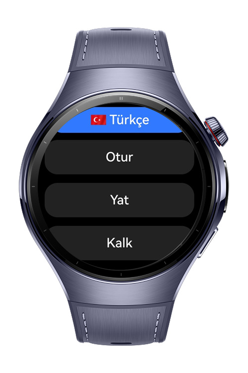
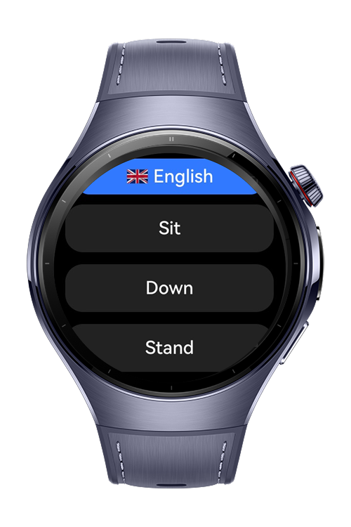

> **Note:** To access all shared projects, get information about environment setup, and view other guides, please visit [Explore-In-HMOS-Wearable Index](https://github.com/Explore-In-HMOS-Wearable/hmos-index).

# PetTranningSampleApp

**PetTranningSampleApp** is a lightweight HarmonyOS wearable application designed for training and controlling dogs using sound-based interaction. It allows users to play various dog-training command sounds in **Turkish** or **English**, as well as trigger a special **dog repellent** sound for deterring aggressive or stray dogs.

This app is optimized for smartwatch use with simple interaction buttons and offline audio playback support.

# Preview

<p>
  
  
</p>

# Use Cases

- **Train dogs** by playing consistent vocal commands in Turkish or English (e.g., *Sit*, *Come*, *Stop*).
- **Switch language** dynamically with a language toggle at the top of the screen.
- **Trigger dog repellent** ultrasonic sound at the bottom of the list to scare off stray or aggressive dogs.
- **Use offline**: All sounds are embedded in the app and work without an internet connection.

# Tech Stack

- **Languages**: ArkTS, ArkUI, TypeScript
- **Frameworks**: HarmonyOS SDK 5.1.0(18)
- **Tools**: DevEco Studio Version 5.1.1.823
- **Libraries**:
    - `@kit.ArkUI`
    - `@kit.ArkTS`
    - `@kit.AudioKit`

# Directory Structure

```
entry/src/main/ets/
├── components/
│ ├── CustomButton.ets # Reusable button component for command sounds
│ ├── MediaButton.ets # Button with sound playback integration
│ └── TextQuestion.ets # Optional text-based helper (for visual command display)
│
├── entryability/
│ └── EntryAbility.ets # Main launcher
│
├── entrybackupability/
│ └── EntryBackupAbility.ets # Optional backup entry (e.g., widget form)
│
├── pages/
│ ├── Index.ets # Root router
│ └── LandingPage.ets # Main UI with language toggle and buttons
│
├── resources/
│ └── module.json5 # App metadata & routing
│
├── mock/
│ └── mock-config.json5 # Optional mock audio mappings
```

# Constraints and Restrictions

- **Limited UI Size**: Layout is optimized for smartwatch screens only.
- **No Custom Sounds**: Users cannot record or add their own commands.
- **Audio Only**: No vibration or LED feedback; only sound is used.

## Supported Device

- **Huawei Watch 4/5 Series**
- Any **HarmonyOS wearable** device supporting atomic services and media playback

# License

**DogTrainerWatchApp** is released under the MIT License.  
See the [LICENSE](./LICENSE) file for more information.

